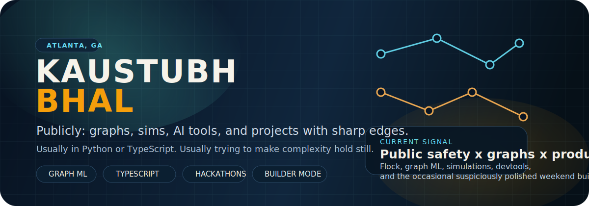

<p align="center">
  
</p>

<p align="center">
  <a href="https://github.com/kaustubhbhal">GitHub</a>
  ·
  <a href="https://www.linkedin.com/in/kaustubh-bhal/">LinkedIn</a>
  ·
  <a href="https://devpost.com/kbhal3">Devpost</a>
</p>

## who i am

I work on public safety tech at Flock.

The rest of my public footprint is mostly:

- AI and machine learning
- graph-heavy systems
- simulation and analytics
- products that need both engineering and taste

So far that's looked like healthcare graph models, portfolio stress testing, AI learning tools, campus safety systems, and developer workflow experiments.

## quick read

- based in Atlanta
- Python and TypeScript most days
- strong bias toward things that can survive contact with real users

## featured builds

| Project | What it is | Stack | Signal |
| --- | --- | --- | --- |
| [`contextually`](https://github.com/kaustubhbhal/contextually) | A developer-tooling project focused on making context switching easier. | TypeScript | One of my most recent public repos. |
| [`MedGraph`](https://github.com/kaustubhbhal/MedGraph) | Privacy-preserving disease progression prediction with graph neural networks. | Python, PyTorch, graphs | HooHacks 2025 project. |
| [`Black Swan`](https://github.com/kaustubhbhal/Black-Swan) | AI-assisted portfolio stress testing with Monte Carlo simulation and risk analytics. | TypeScript, Python, Next.js, Flask | Won Best Finance Hack at Hacklytics 2025. |
| [`GraphIQ`](https://github.com/kaustubhbhal/GraphIQ) | A conversational learning tool that explains concepts with generated diagrams and guided practice. | TypeScript, Next.js, Flask, Mermaid | Built around interactive visual learning. |
| [`STAMP-AI`](https://devpost.com/software/stamp-ai) | Computer-vision system for active threat tracking across CCTV networks. | Python, YOLO, OpenCV | Winner at HackGT X. |
| [`BlazeCast`](https://devpost.com/software/blazecast) | Wildfire spread prediction with mapping, ML, and response-oriented visualization. | Python, Flask, maps, ML | Won Best Sustainability Hack at AI ATL. |

## selected wins

- Best Finance Hack, Hacklytics 2025
- Best Sustainability Hack, AI ATL
- Best INNOVATE Hack, HackGT X

## recurring motifs

```text
graphs -> because relationships matter more than rows
simulations -> because "what if" is half the fun
hackathon builds -> but only the ones with a shot at being real
interfaces -> if the model is good but the UX is bad, it still loses
```

## day to day

At Flock, I work on software in the public safety space.

Outside of that, I keep ending up in projects where the constraints are ugly, the timeline is short, and the final demo has to make people immediately get it.

## non-code patch notes

gaming, skiing, guitar

## github snapshot

<p align="center">
  
  
</p>

<p align="center">
  
</p>

## say hi

If you are building in any of those lanes, reach out.
